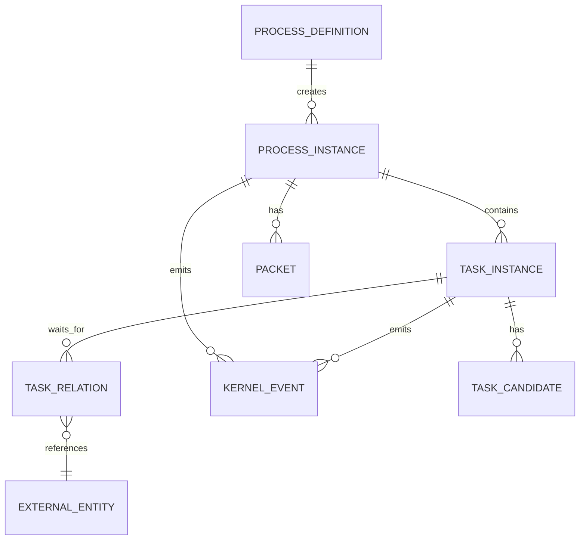

# 数据模型

## 数据范围

| 范围 | Owner | 生命周期 | 典型内容 |
| --- | --- | --- | --- |
| Process data | `ProcessInstance` | 整个流程 | 业务 ID、路由输入、累计输出 |
| Task data | `TaskInstance` | 单次任务执行 | 表单 ID、handler 本地状态、重试信息 |
| Form data | `FormService` | 单个表单实例 | 初始化值、渲染值、提交值 |
| Engine variables | `WorkflowEngine` adapter | 引擎执行期 | 路由所需的过滤变量 |
| Event data | `flow-kernel-event` | 事件保留期 | 生命周期事实、投递状态、重试信息 |

这些范围不能混成一个大 Map，即使当前 baseline 使用 `Map<String, String>`。

## 逻辑关系

`EXTERNAL_ENTITY` 是概念实体，可以是表单、子流程、远程任务、签约任务等。

## 主要表语义

### process_definition

- 流程定义 key
- 展示名
- 任务配置
- 版本/状态后续补齐

### process_instance

- 业务流程实例 ID
- 流程定义 key
- 状态
- 父流程实例 ID
- 关联任务实例 ID
- 流程数据

### task_instance

- 业务任务实例 ID
- 流程实例 ID
- 引擎任务 ID
- taskCode
- taskName
- 状态
- 任务数据

taskCode 不是唯一键，因为流程可以回到同一个 BPMN 节点。

### task_relation

- 任务实例 ID
- relationType
- relationInstanceId
- 状态

表单、子流程、外部回调都可以用同一张关系模型表达。

### packet

- 当前 packet value 指针
- packet 状态
- packet value 历史

### task_candidate

- 流程实例 ID
- 任务实例 ID
- ucid/userCode/userName
- 软删除状态

## 引擎变量投影

不要把所有流程数据塞进引擎变量。

引擎变量应该：

- 显式白名单或映射。
- 只包含网关和路由需要的数据。
- 避免大对象和表单正文。
- 不修改调用方传入的流程数据 Map。

