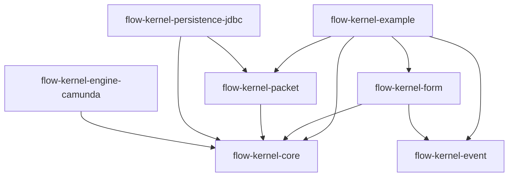

# 架构说明

`open-flow-kernel` 的核心架构是把业务流程语义和流程引擎路由能力拆开：

```text
业务应用
  -> Process
  -> Task
  -> Form / External Relation
  -> WorkflowEngine
```

流程引擎决定哪个节点被激活；内核决定这个节点在业务上意味着什么、如何初始化、如何等待外部完成、如何写入业务数据。

## 设计主张

原实现有价值的地方在于，它没有让 BPMN、表单、审批页、业务数据混成一个模型，而是拆成：

- `Process`：业务流程实例、状态、流程数据、父子流程关系。
- `Task`：引擎节点对应的业务任务实例，负责生命周期。
- `Form / External Relation`：任务等待的外部输入或外部动作。
- `WorkflowEngine`：状态机，只负责路由和激活任务。

## 事实源

| 关注点 | 事实源 |
| --- | --- |
| 业务流程状态 | `ProcessInstanceRepository` |
| 业务任务状态 | `TaskInstanceRepository` |
| 表单状态和值 | `FormService` 实现 |
| 外部等待状态 | `TaskRelationRepository` |
| BPMN token / 路由 | `WorkflowEngine` 实现 |
| 生命周期投递、重试、回放 | `flow-kernel-event` |

Camunda 或其他引擎不是业务任务完成的事实源。

## 模块结构

当前模块：

```text
flow-kernel-core
flow-kernel-engine-camunda
flow-kernel-event
flow-kernel-form
flow-kernel-packet
flow-kernel-persistence-jdbc
flow-kernel-example
```

依赖方向：



`core` 不依赖 Camunda、Spring、JDBC、具体表单实现。

`flow-kernel-engine-camunda` 是 第二轮 的最小 Camunda 7 adapter。它只负责把 Camunda 的 start/complete/query/listener API 接到 `WorkflowEngine`，不是 Spring Boot starter，也不负责部署管理、历史查询或生产运维能力。

## 组件职责

### Process 层

- 校验流程定义。
- 创建业务流程实例。
- 保存流程状态和流程数据。
- 处理流程完成、挂起、继续、取消。
- 支持父子流程关系。

### Task 层

- 响应引擎 task-created 回调创建业务任务。
- 执行 `init`、`afterInit`、`beforeComplete`、`postComplete`。
- 保存任务状态和任务数据。
- 推进流程引擎任务完成。

### Form / External Relation 层

表单只是外部实体的一种。通用规则是：

```text
外部实体完成
-> TaskRelation 完成
-> 检查任务所有关系
-> 任务可完成
```

子流程、远程回调、签约、异步作业也可以走同一机制。

### Engine Adapter

引擎适配器负责：

- 使用业务流程实例 ID 作为 `businessKey` 启动流程。
- 用业务 `taskCode` 完成当前引擎任务。
- 把引擎回调转换成内核事件。
- 隔离所有引擎专有 API。

## 当前状态与目标

| 领域 | 当前 | 目标 |
| --- | --- | --- |
| 引擎 | in-memory 示例运行时 + Camunda 7 adapter baseline | 已跑通 Camunda + Process-Task-Form 闭环 |
| 持久化 | JDBC baseline + Event JDBC baseline + 通用表 repository baseline | 后续补 MySQL/Testcontainers |
| Form | 独立 `flow-kernel-form` + multi-form baseline | 后续补业务 UI/form-platform side effects |
| Event | 内存事件存储 + JDBC event store baseline | 后续补 Spring transaction adapter 和运维 API |
| 示例 | integrated example 覆盖 Form/SubProcess/Packet/Candidate/Event/Camunda | 继续保持一个主示例入口 |

第二轮 已证明“Camunda 作为状态机 + 内核拥有业务流程语义”的参考闭环；第三轮 已补主要 bounded parity，剩余集中在 MySQL/Testcontainers 验证和 deferred 能力边界审计。
