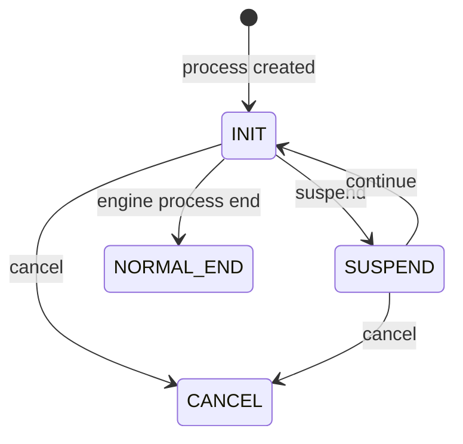
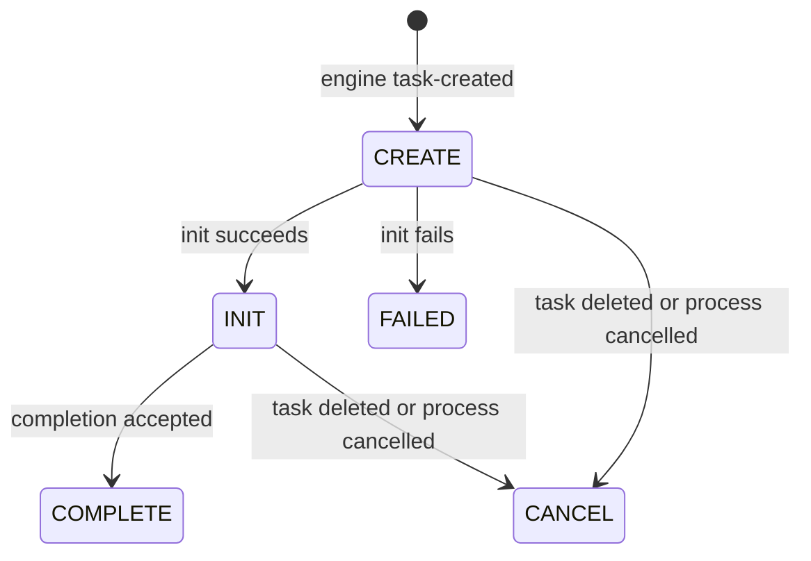
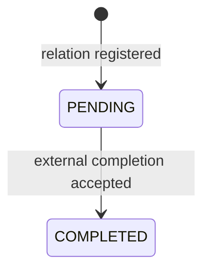
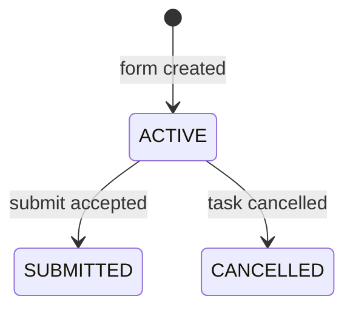

# 状态机

每个状态迁移都应该有明确 owner。调用方只能请求迁移，repository 通过 CAS 或等价机制保证并发安全。

## 流程实例

| 迁移 | Owner | 前置条件 | 重试行为 |
| --- | --- | --- | --- |
| create -> `INIT` | `ProcessService` | 流程定义有效 | 后续需要请求幂等键 |
| `INIT` -> `SUSPEND` | 流程生命周期服务 | 流程运行中 | 重复挂起应幂等 |
| `SUSPEND` -> `INIT` | 流程生命周期服务 | 流程已挂起 | 重复继续应幂等 |
| `INIT` -> `NORMAL_END` | 引擎 process-end 消费者 | 引擎流程结束 | 重复完成忽略 |
| active -> `CANCEL` | 流程生命周期服务 | 非终态 | 重复取消忽略 |

## 任务实例

当前复刻基线：

`COMPLETING` 不是当前抽取目标。它是后续可靠性改进候选，因为原实现没有该状态。

## 任务关系

`TaskRelation` 单调完成。重复回调不应导致任务重复完成。

## 表单实例

表单提交只是外部实体完成，任务是否完成由 `TaskRelationService` 判断。

## 非法迁移

非法迁移必须：

1. 不修改状态。
2. 暴露当前状态和目标状态。
3. 区分幂等重复请求和真正冲突。
4. 可以通过日志、事件或失败记录观察。

