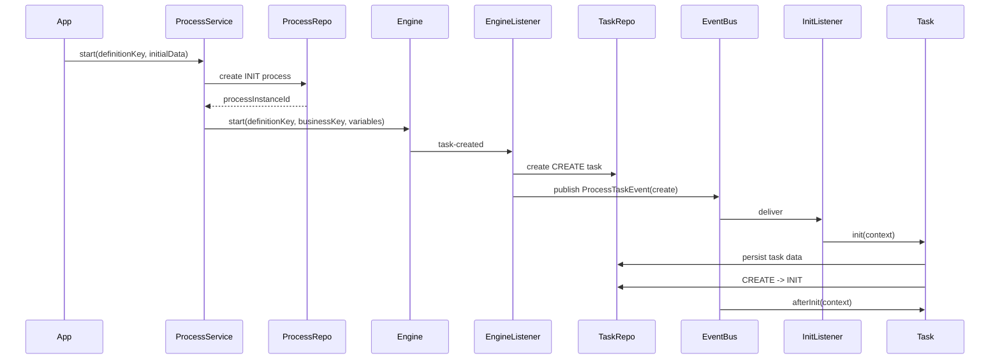
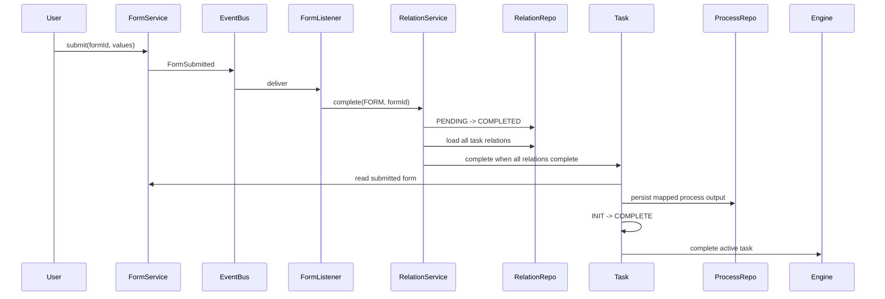
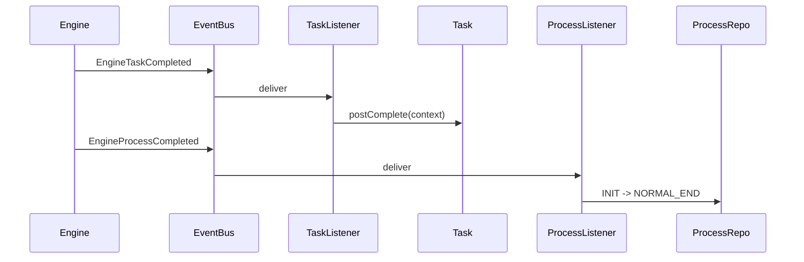
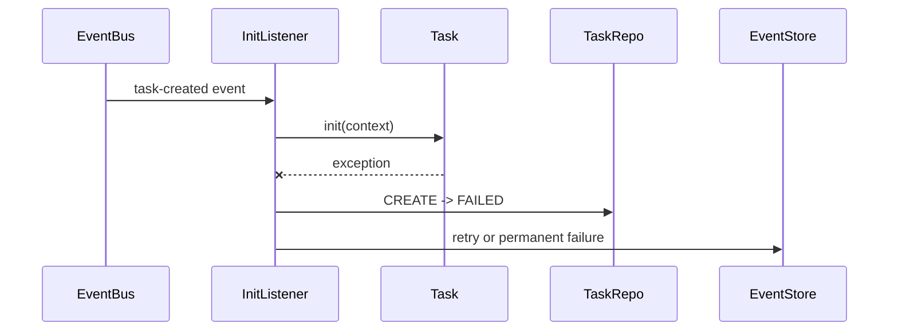

# 运行时序

## 启动流程

```mermaid
sequenceDiagram
    participant App
    participant ProcessService
    participant ProcessRepo
    participant Engine
    participant EngineListener
    participant TaskRepo
    participant EventBus
    participant InitListener
    participant Task

    App->>ProcessService: start(definitionKey, initialData)
    ProcessService->>ProcessRepo: create INIT process
    ProcessRepo-->>ProcessService: processInstanceId
    ProcessService->>Engine: start(definitionKey, businessKey, variables)
    Engine->>EngineListener: task-created
    EngineListener->>TaskRepo: create CREATE task
    EngineListener->>EventBus: publish ProcessTaskEvent(create)
    EventBus->>InitListener: deliver
    InitListener->>Task: init(context)
    Task->>TaskRepo: persist task data
    Task->>TaskRepo: CREATE -> INIT
    EventBus->>Task: afterInit(context)
```

## 表单任务完成

```mermaid
sequenceDiagram
    participant User
    participant FormService
    participant EventBus
    participant FormListener
    participant RelationService
    participant RelationRepo
    participant Task
    participant ProcessRepo
    participant Engine

    User->>FormService: submit(formId, values)
    FormService->>EventBus: FormSubmitted
    EventBus->>FormListener: deliver
    FormListener->>RelationService: complete(FORM, formId)
    RelationService->>RelationRepo: PENDING -> COMPLETED
    RelationService->>RelationRepo: load all task relations
    RelationService->>Task: complete when all relations complete
    Task->>FormService: read submitted form
    Task->>ProcessRepo: persist mapped process output
    Task->>Task: INIT -> COMPLETE
    Task->>Engine: complete active task
```

当前顺序保留原版语义：先完成业务任务，再调用引擎完成任务。可靠 command store 是后续改进候选，不属于当前复刻目标。

## 引擎完成回调

```mermaid
sequenceDiagram
    participant Engine
    participant EventBus
    participant TaskListener
    participant Task
    participant ProcessListener
    participant ProcessRepo

    Engine->>EventBus: EngineTaskCompleted
    EventBus->>TaskListener: deliver
    TaskListener->>Task: postComplete(context)
    Engine->>EventBus: EngineProcessCompleted
    EventBus->>ProcessListener: deliver
    ProcessListener->>ProcessRepo: INIT -> NORMAL_END
```

## 任务初始化失败

```mermaid
sequenceDiagram
    participant EventBus
    participant InitListener
    participant Task
    participant TaskRepo
    participant EventStore

    EventBus->>InitListener: task-created event
    InitListener->>Task: init(context)
    Task--xInitListener: exception
    InitListener->>TaskRepo: CREATE -> FAILED
    InitListener->>EventStore: retry or permanent failure
```

重试不能创建第二个 active task，也不能重复创建表单关系。

